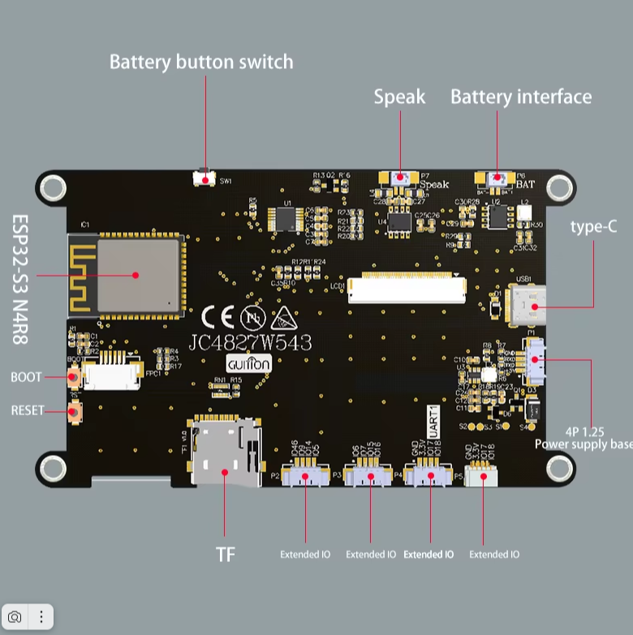
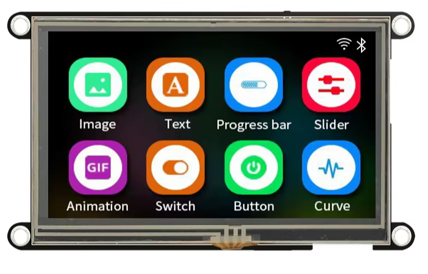
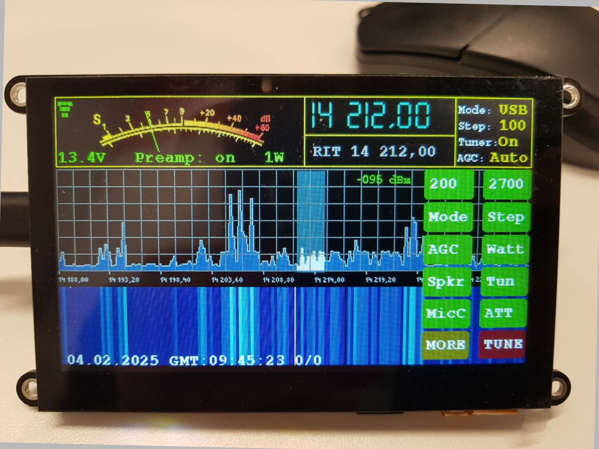
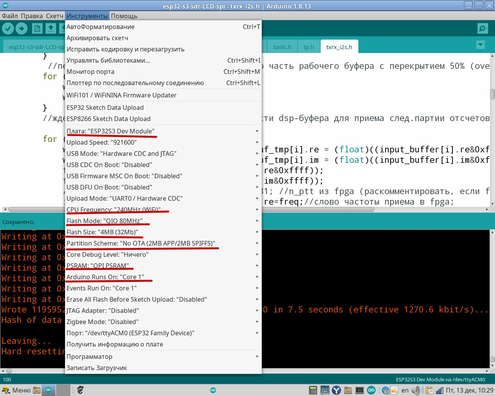

# xiegu_g90_panel

Это проект по замене штатной панели на трансивере xiegu-g90
Основан на дисплейном модуле со встроенным контроллером esp32s3 и наработках 
по реверс инжинирингу https://github.com/zeroping/xiegu-g90-headprotocol
  

https://aliexpress.ru/item/1005006729377800.html?sku_id=12000038112486569&spm=a2g2w.productlist.search_results.0.b16113b9wN5BTJ 
(обязательно с емкостным тачскрином)

Все управление через тачскрин и энкодер. 
Интерфейс выглядит приблизительно вот так:  
 
  
Все области тачскрина на экране функциональны. 
Схема панели в файле esp32s3-panel-xiegu-g90.pdf 
  
На данный момент реализованы все основные функции трансивера 
за исключением SPLIT и переключения vfoA/vfoB (за не надобностью). 

Также реализован (пока без тестирования) базовый функционал управления через CAT-интрефейс 
(прием/передача, смена частоты и режима (LSB/USB/CW/AM))

Краткая инструкция: 
Вращение энкодера изменяет текущие параметры: 
  - частоту, если не выведены на экран другие параметры
  - громкость, мощность, частоты скатов фильтров и др, если они выведены на экран.
  - нажатие на энкодер - включение трансивера
  - короткое нажатие на энкодер во время изменения параметров возвращает в режим перестройки частоты
  - длительное нажатие на энкодер во время работы - выключение трансивера

Области экрана для тачскрина (сверху вниз, слева направо):
  - S-метр - сохранение основных текущих параметров (восстанавливаются после включения)
  - Частота настройки - выбор диапазона
  - RIT - включение/выключение режима расстройки
  - Область текущих параметров - включение/выключение меню настроек и упрвления
  - Область спектра(без выведенных параметров) - левая половина уменьшает частоту настройки -24кГц
  - Область спектра(без выведенных параметров) - правая половина увеличивает частоту настройки +24кГц
  - Область спектра(с выведенными параметрами) - левая половина уменьшает показания
  - Область спектра(с выведенными параметрами) - правая половина увеличивает показания
  - Область "водопада" - левая/правая половина - увеличивает/уменьщает громкость на 1 ступень

Добавлена функция сканирования КСВ в пределах текущего диапазона. 
Управления с гарнитуры нет. Если будет время и разберусь с протоколом, то возможно, реализую.

Настройки Ардуино для сборки проекта: 
 

Коротенькое видео: 

https://github.com/user-attachments/assets/96ce7fe5-5e5e-4ab0-87d7-d71a0492657b

