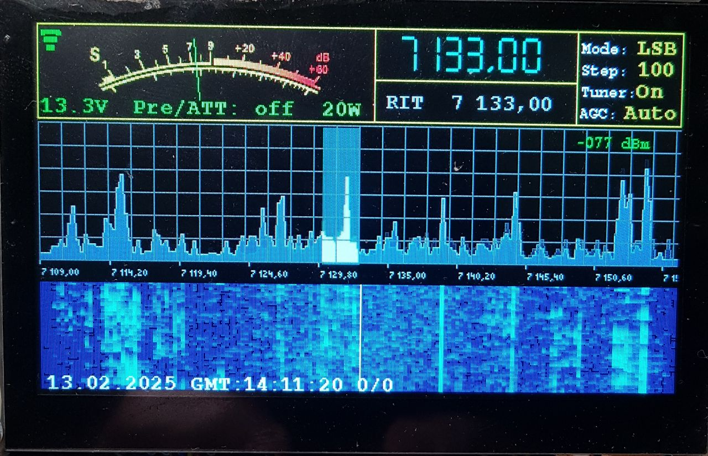

# xiegu_g90_panel

Это проект по замене штатной панели на трансивере xiegu-g90
Основан на дисплейном модуле со встроенным контроллером esp32s3 и наработках 
по реверс инжинирингу https://github.com/zeroping/xiegu-g90-headprotocol
  

https://aliexpress.ru/item/1005006729377800.html?sku_id=12000038112486569&spm=a2g2w.productlist.search_results.0.b16113b9wN5BTJ 
(обязательно с емкостным тачскрином)

Все управление через тачскрин и энкодер 
Интерфейс выглядит приблизительно вот так  
 
  
Все области тачскрина на экране функциональны. 
Схема панели в файле esp32s3-pane~iegu-g90.pdf 
  
На данный момент реализованы все основные функции трансивера 
за исключением SPLIT и переключения vfoA/vfoB (за не надобностью). 

Также реализован (пока без тестирования) базовый функционал управления через CAT-интрефейс 
(прием/передача, смена частоты и режима (LSB/USB/CW/AM))

